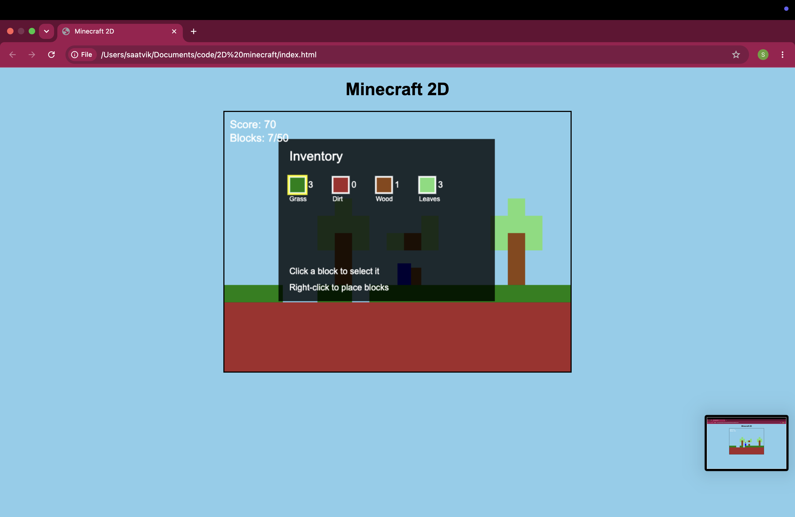

# 2D Minecraft

A game based on minecraft, with the goal to break 50 blocks in order to win. Players also have the freedom to use it to make builds 
with blocks that they mine. 

# Features
- Move around a medium sized island 
- Break, pickup & place blocks 
- Inventory HUD 
- Beat the game by breaking 50 blocks 

# Screenshots 

# Controls 
W / Up-arrow key - Jump
A / Left-arrow key - Move left
D / Right-arrow key - Move right 
E - Access inventory 
LMB - Break block 
RMB - Place block 

# How to play

1. Click enter to start the game when on the menu screen 
2. Use WAD to move around (spacebar is also jump)
3. Hold Left click to mine blocks, and right click to place blocks 
4. View blocks in your inventory by clicking E 
5. Break 50 blocks to beat the game! 

# Tech Stack
- Static HTML 
- Javascript 
- CSS